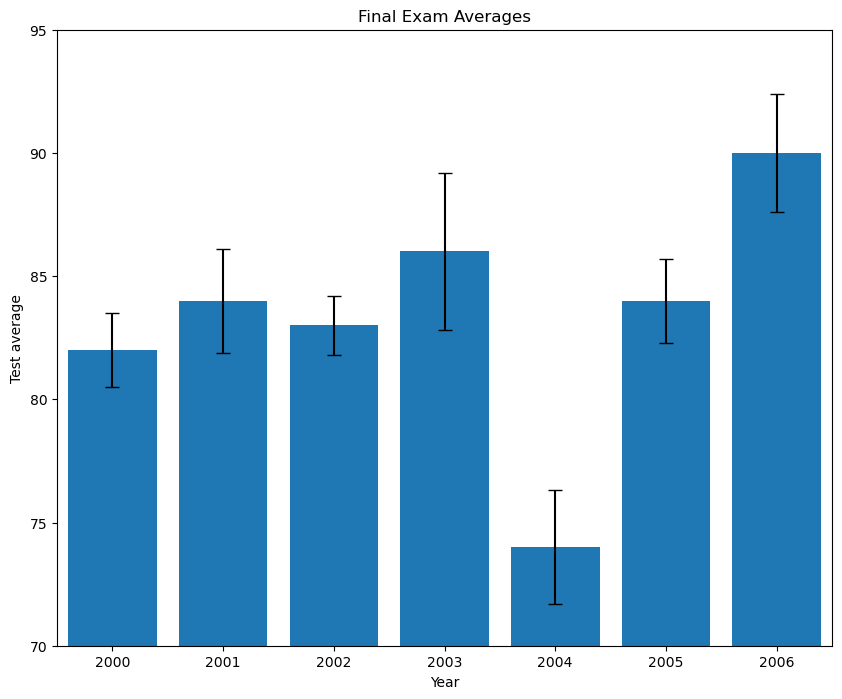

```python
from matplotlib import pyplot as plt

past_years_averages = [82, 84, 83, 86, 74, 84, 90]
years = [2000, 2001, 2002, 2003, 2004, 2005, 2006]
error = [1.5, 2.1, 1.2, 3.2, 2.3, 1.7, 2.4]

# Make your chart here
#task 1: creating a figure of width 10 and height 8
plt.figure(figsize = (10, 8))

#task 2: plotting a bar chart using past_years_averages
#task 3: adding error bars of cap size 5 and heights corresponding to the error list
plt.bar(range(len(past_years_averages)), past_years_averages, yerr = error, capsize = 5)

#task 4: setting the axis to go from -0.5 to 6.5 on the x-axis and 70 to 95 on the y-axis
plt.axis([-0.5,6.5,70,95])

#task 5: setting the x-axis ticks
ax = plt.subplot()
ax.set_xticks(range(len(years)))
ax.set_xticklabels(years)

#task 6: adding title name, x label and y label
plt.title("Final Exam Averages")
plt.xlabel("Year")
plt.ylabel("Test average")

#task 7: saving figure to a file called my_bar_chart.png
plt.savefig("my_bar_chart.png")
plt.show()
plt.clf()
```


    

    


    <Figure size 640x480 with 0 Axes>

